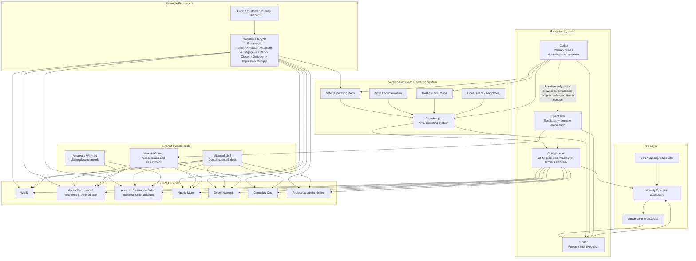

# WMS Architecture Topology

This topology shows how the WMS operating architecture fits together across strategy, version-controlled documentation, implementation tracking, CRM execution, shared tools, and business lanes.

The architecture is intentionally lightweight:

- Lucid provides the strategic customer journey framework.
- The WMS operating docs preserve the framework in GitHub.
- Linear tracks implementation work.
- GoHighLevel executes CRM, pipelines, workflows, forms, and calendars.
- Codex is the primary build and documentation operator.
- OpenClaw is used only when browser automation or complex task execution is needed.
- Each business lane can reuse the same lifecycle framework.

## Operating Flow

1. Lucid / Customer Journey Blueprint feeds the WMS operating docs.
2. WMS operating docs live in the GitHub repo.
3. Linear tracks implementation.
4. GoHighLevel executes CRM and customer lifecycle operations.
5. Codex updates docs, repos, and implementation issues.
6. OpenClaw is used only when browser automation or complex task execution is needed.
7. Each business lane can use the same lifecycle framework with lane-specific fields, offers, systems, and SOPs.

